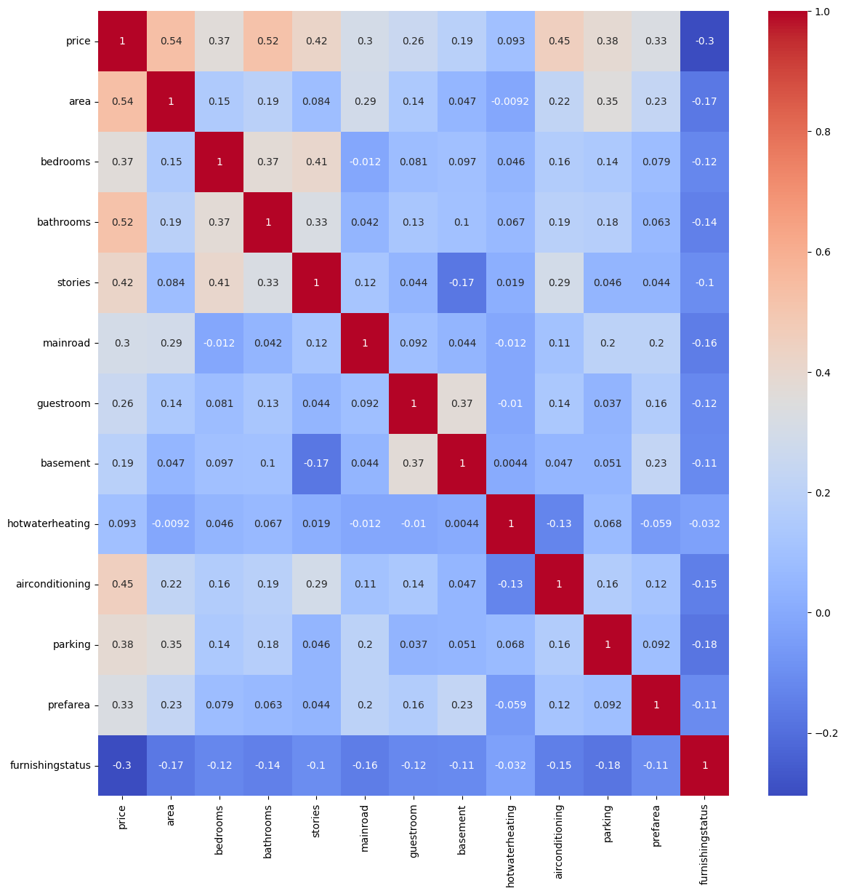

# House Price Prediction

This project focuses on predicting house prices using machine learning techniques. It aims to provide a reliable model that can estimate the price of a house based on various features.

## Dataset

- **Source**: [Kaggle](https://www.kaggle.com/datasets/harishkumardatalab/housing-price-prediction) 
- **Features**: The dataset includes features like:
  - `price`: The price of the house (target variable).
  - `area`: The total area of the house.
  - `bedrooms`: Number of bedrooms.
  - `bathrooms`: Number of bathrooms.
  - `stories`: Number of stories.
  - `mainroad`: Connectivity to main road.
  - `guestroom`: Availability of guestroom.
  - `basement`: basement is present or not.
  - `hotwaterheating`: heating water option.
  - `aircontitionint`: air contitionint option.
  - `parking`: Availability of parking space.
  - `prefarea`: is loction preferable
  - `furnishingstatus`: furnishing status of house

## Installation

Follow these steps to set up the project environment:

1. **Clone the repository**:
   ```bash
   git clone https://github.com/TheValour/House-Price-Prediction.git
   cd House-Price-Prediction
   ```


2. **Create a Virtual Environment**:

    To create a virtual environment in the project directory:

    ```bash
    python -m venv .venv
    ```

    This will create a virtual environment named `.venv` in the current directory.

3. **Activate the Virtual Environment**:

    To activate the virtual environment, use the following command:

    - **For Windows:**

    ```bash
    .venv\Scripts\activate
    ```

    - **For macOS/Linux:**

    ```bash
    source .venv/bin/activate
    ```

    Once activated, you should see the virtual environment's name in your terminal prompt, indicating that the environment is active.

4. **Install Required Packages**:

    After activating the virtual environment, install the required packages using:

    ```bash
    pip install -r requirements.txt
    ```

    This command will install all the dependencies listed in the `requirements.txt` file.

## Visualization

Below is data distrubtion

<div>
<table border="1" class="dataframe">
  <thead>
    <tr style="text-align: right;">
      <th></th>
      <th>price</th>
      <th>area</th>
      <th>bedrooms</th>
      <th>bathrooms</th>
      <th>stories</th>
      <th>parking</th>
    </tr>
  </thead>
  <tbody>
    <tr>
      <th>count</th>
      <td>5.450000e+02</td>
      <td>545.000000</td>
      <td>545.000000</td>
      <td>545.000000</td>
      <td>545.000000</td>
      <td>545.000000</td>
    </tr>
    <tr>
      <th>mean</th>
      <td>4.766729e+06</td>
      <td>5150.541284</td>
      <td>2.965138</td>
      <td>1.286239</td>
      <td>1.805505</td>
      <td>0.693578</td>
    </tr>
    <tr>
      <th>std</th>
      <td>1.870440e+06</td>
      <td>2170.141023</td>
      <td>0.738064</td>
      <td>0.502470</td>
      <td>0.867492</td>
      <td>0.861586</td>
    </tr>
    <tr>
      <th>min</th>
      <td>1.750000e+06</td>
      <td>1650.000000</td>
      <td>1.000000</td>
      <td>1.000000</td>
      <td>1.000000</td>
      <td>0.000000</td>
    </tr>
    <tr>
      <th>25%</th>
      <td>3.430000e+06</td>
      <td>3600.000000</td>
      <td>2.000000</td>
      <td>1.000000</td>
      <td>1.000000</td>
      <td>0.000000</td>
    </tr>
    <tr>
      <th>50%</th>
      <td>4.340000e+06</td>
      <td>4600.000000</td>
      <td>3.000000</td>
      <td>1.000000</td>
      <td>2.000000</td>
      <td>0.000000</td>
    </tr>
    <tr>
      <th>75%</th>
      <td>5.740000e+06</td>
      <td>6360.000000</td>
      <td>3.000000</td>
      <td>2.000000</td>
      <td>2.000000</td>
      <td>1.000000</td>
    </tr>
    <tr>
      <th>max</th>
      <td>1.330000e+07</td>
      <td>16200.000000</td>
      <td>6.000000</td>
      <td>4.000000</td>
      <td>4.000000</td>
      <td>3.000000</td>
    </tr>
  </tbody>
</table>
</div>

### Corelation between all the  features
 

## Results

The final model achieved the following performance:

### - **R2 score**: 0.6463

These metrics indicate the accuracy of the model in predicting house prices.

*[Streamlit app link](https://gharkikimat.streamlit.app/)*

> by TheValour 🤖

